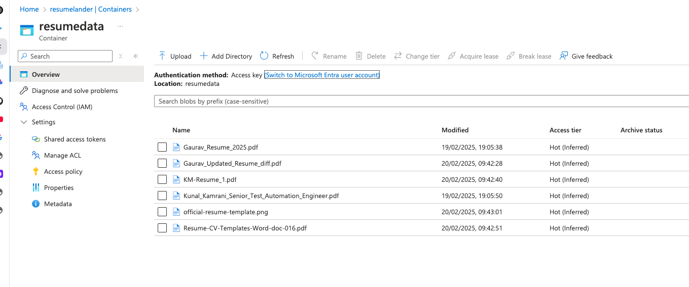

## **Usage of the project:**
The _Applicant Explorer_ project deals with upload of resume on the portal. 
It gives users/recruiters an ability to look for the right applicants keywords and semantic search as well powered by AI.

### Tech stacks: ###

* Python flask
* Azure storage account
* Azure document intelligence with custom model
* Azure AI search
* Azure key vault
* Azure Service principle
* Azure Open AI

# **System Architecture** 

3) Create an azure storage blob account with container, also generate a SAS token so that document intelligence can use blob urls

4) Create an azure document intelligence service

5) In document intelligence service- Create a custom model to train resume data and use the same model in python sdk.

6) Create an Azure AI Search service 

7) Create an Azure Open AI service 

8) Deploy an azure open AI model, make sure you get the right quota raised as tokens are limited.

8) Link the data set of azure ai search index

9) Also, once AI search is configured using open AI, also create a semantic configuration in AI search so that open AI can use it.

7) Create an azure key vault and store keys of all services of document intelligence(form recognizer),storage account key, ai search endpoint and key, open ai endpoint and keys.

8) Create a service principal which can be called in your python code to interact with azure key vault
Also, note the client id, tenant id, secret key for app to be invoked in program using environmental variable.

9) Add that service principal to have access to have role assignment on the key vault. Also, go to access configuration to give service principal get and set access.

Working model:

1) Auth mechanism for all the services use endpoint and keys values stored in key vault via service principal.

3) User will upload a resume. Resume will be sent to blob storage. 

3) Once document is stored in blob, using URL of blob, document intelligence will read the blob and extract the data. Document intelligence users blob SAS token to access it. 
4) Extracted data points are passed to AI search for indexing the resumes - if index already created, it won't recreate the index again and only insert a new record, if index is not created, it will create the index first then insert the record. 

5) User can use keyword search using AI search indexed created in last step to get the citation of results

6) User can also chat with the chatbot to get NLP kind responses as AI search is linked dataset in Azure Open AI. The model used by open AI is gpt-4o completion model.

# **Note: Do not forget to delete the resources after usage**